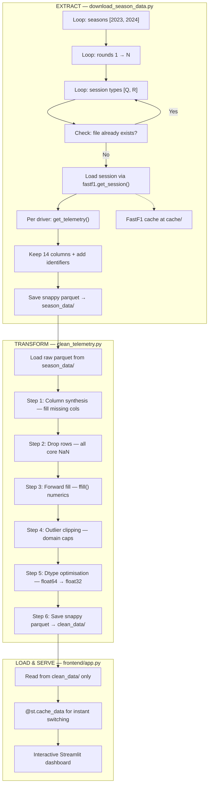
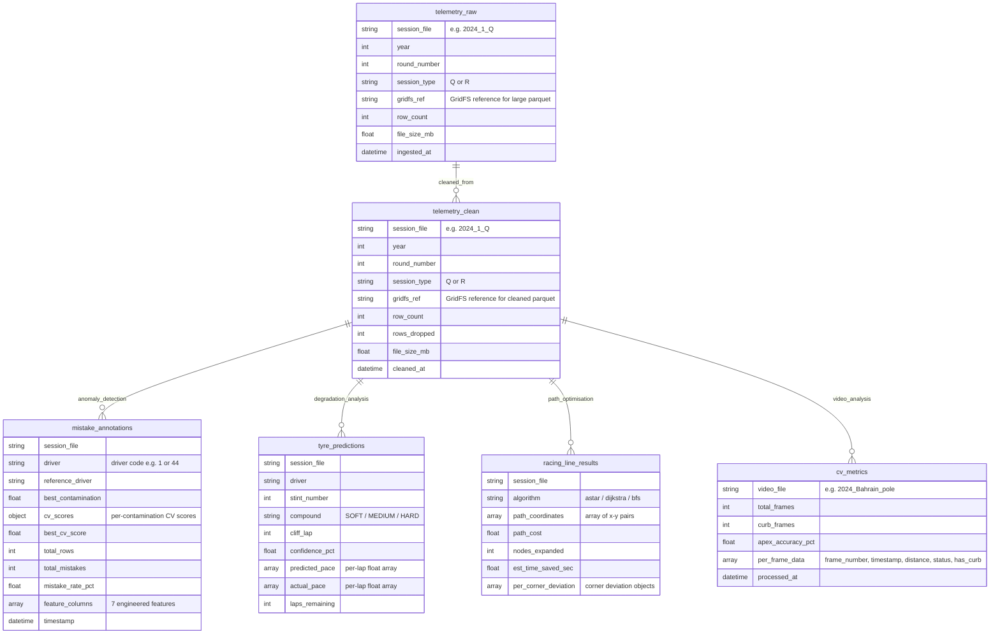
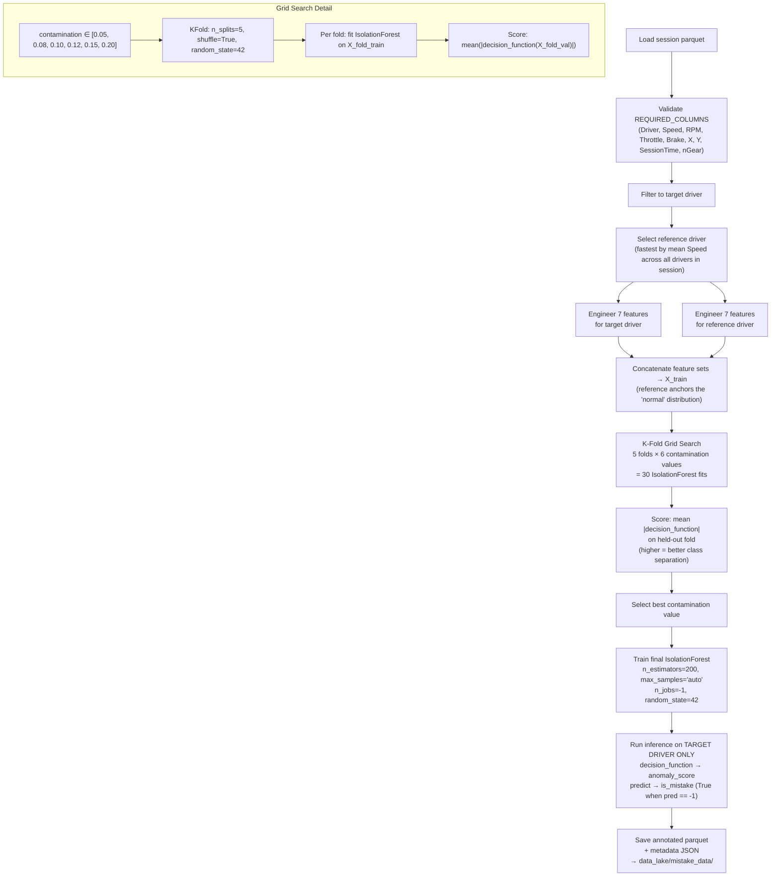
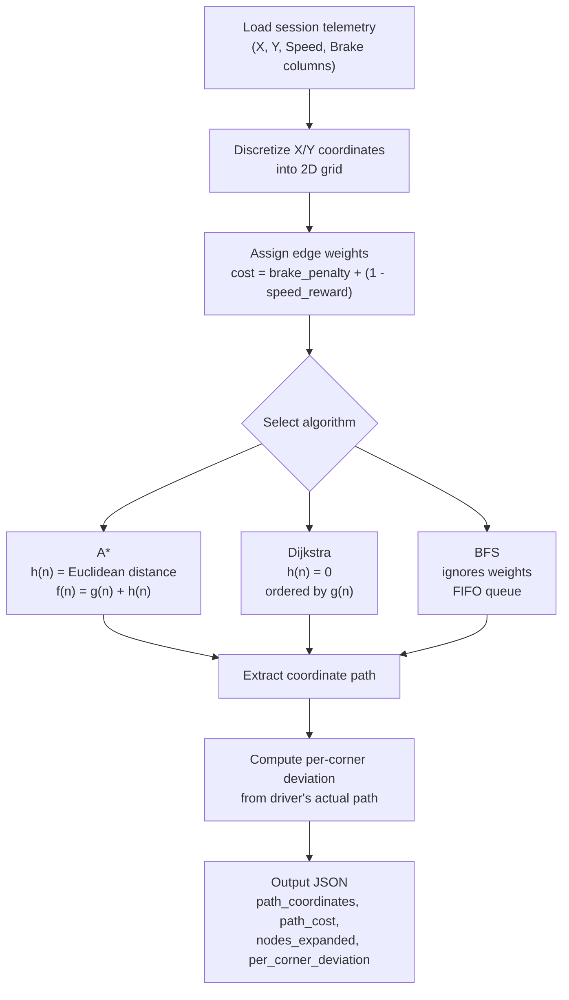
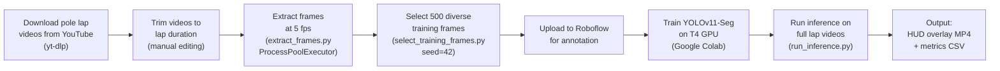

# ApexHunter 2.0 — Project Documentation

**Project Title:** ApexHunter 2.0 — F1 Telemetry Analytics Dashboard  
**Student:** Parin Shah (ID: 23001091)  
**Courses:** Artificial Intelligence · Computer Vision · Big Data  
**Academic Year:** 2024–2025  

ApexHunter 2.0 is an end-to-end data analytics platform that ingests official Formula 1 telemetry and onboard video footage, applies machine-learning and computer-vision techniques to extract actionable racing insights, and presents the results through an interactive Streamlit dashboard. The project spans three academic disciplines — Big Data (ETL pipeline engineering and storage architecture), Artificial Intelligence (anomaly detection, time-series prediction, and graph search), and Computer Vision (instance segmentation for apex deviation measurement). Each section below is self-contained and addresses the requirements of its respective course.

---

# 1. Big Data

This section covers the data engineering foundation of ApexHunter 2.0: the datasets consumed, the ETL pipeline that prepares them, the storage architecture that organises them, and the database integration planned for cross-session queryability. The project processes approximately 57.8 million telemetry rows and 46 onboard video files spanning the 2023 and 2024 Formula 1 seasons.

## 1.1 Dataset Overview

### Structured Dataset — FastF1 Telemetry

The primary structured dataset is sourced from the official F1 Timing APIs via the **fastf1** Python library. FastF1 provides lap-by-lap and sample-by-sample telemetry for every driver in every session (qualifying and race) across a full season.

| Property | Detail |
|---|---|
| **Source** | Official F1 Timing APIs via the `fastf1` Python library |
| **Format** | Snappy-compressed Apache Parquet files |
| **Scale** | ~57.8 million rows, ~1.7 GB cleaned, 92 parquet files |
| **Seasons** | 2023 and 2024 |
| **Sessions per round** | Qualifying (Q) and Race (R) |
| **File naming** | `{year}_{round}_{session_type}.parquet` (e.g. `2024_1_Q.parquet`, `2024_1_R.parquet`) |
| **Raw storage** | `data_lake/season_data/` |
| **Cleaned storage** | `data_lake/clean_data/` |

**Core Feature Columns (10):**

| Column | Dtype | Unit / Description |
|---|---|---|
| `Speed` | float32 | Vehicle speed in km/h |
| `RPM` | float32 | Engine revolutions per minute |
| `Throttle` | float32 | Throttle application as percentage (0–100%) |
| `Brake` | float32 | Brake pressure as percentage (0–100%) |
| `X` | float32 | Track position coordinate (x-axis) |
| `Y` | float32 | Track position coordinate (y-axis) |
| `Time` | timedelta | Lap-relative timestamp |
| `SessionTime` | timedelta | Session-relative timestamp |
| `nGear` | int | Current gear number (1–8) |
| `Driver` | string | Driver identification code |

### Unstructured Dataset — Onboard Pole Lap Videos

The secondary dataset consists of onboard camera footage from pole position qualifying laps, providing visual ground truth for driver behaviour analysis and computer vision model training.

| Property | Detail |
|---|---|
| **Source** | YouTube (downloaded via `yt-dlp`) |
| **Content** | Pole position qualifying laps for all 2023 and 2024 races |
| **Format** | MP4 at 1080p resolution |
| **File size** | ~40–50 MB per video |
| **Scale** | ~46 videos, ~1.8 GB total |
| **Storage** | `data_lake/downloaded_videos/` (raw), `data_lake/edited_videos/` (trimmed) |

Additionally, the project includes ~24 PNG circuit satellite images (1280×1280 pixels) sourced from Esri World Imagery via the `staticmap` library, used as background layers for the Track Map visualisation in the frontend.

## 1.2 The 5 Vs Analysis

| V | Structured Telemetry (FastF1) | Unstructured Video (Onboard Laps) |
|---|---|---|
| **Volume** | ~57.8 million rows, ~1.7 GB in 92 parquet files across 2 seasons | ~46 MP4 videos at 1080p, ~1.8 GB total; ~21,282 extracted JPEG frames |
| **Velocity** | Telemetry sampled at ~4 Hz per driver per lap; batch-ingested per session via FastF1 API calls | Videos downloaded in batch; frames extracted at 5 fps for CV processing |
| **Variety** | Structured numeric time-series (speed, RPM, throttle, brake, coordinates, gear) with string identifiers (driver, session) | Unstructured video (MP4), extracted image frames (JPEG), satellite imagery (PNG), and derived tabular CSV metrics |
| **Veracity** | GPS drift in X/Y coordinates; occasional NaN packets from sensor dropouts; outlier values from pit-lane artefacts; qualifying vs race lap imbalance | Variable video quality across tracks and weather conditions; motion blur in high-speed frames; inconsistent camera angles between seasons |
| **Value** | Enables driver mistake detection (Isolation Forest), tyre degradation prediction (LSTM), racing line optimisation (graph search), and comparative performance analysis | Enables geometric apex deviation measurement (YOLOv11-Seg), visual validation of telemetry-detected anomalies, and augmented-reality HUD overlay generation |

## 1.3 ETL Pipeline

The ETL pipeline is divided into three decoupled stages — Extract, Transform, and Load — each implemented as an independent Python script. This separation ensures that any stage can be re-run independently without affecting the others, and the skip-if-exists logic in each stage makes the entire pipeline idempotent.

### Extract Stage

| Property | Detail |
|---|---|
| **Script** | `backend/scripts/download_season_data.py` |
| **Trigger** | Manual terminal execution |
| **Seasons** | Configurable via `backend/config.json` (default: `[2023, 2024]`) |

The extraction script loops over each season, determines the total number of rounds from the official event schedule (`fastf1.get_event_schedule()`), and processes each round for both qualifying (`Q`) and race (`R`) session types. For each session, it loads telemetry for every driver by calling `session.laps.pick_drivers(driver).get_telemetry()`, appends identifier columns (`Driver`, `Round`, `Session`, `Year`), and retains 14 core columns. The output is saved as a snappy-compressed parquet file to `data_lake/season_data/`. A skip-if-exists check prevents redundant downloads, and the FastF1 cache directory (`cache/`) stores API responses to avoid repeated network requests.

### Transform Stage

| Property | Detail |
|---|---|
| **Script** | `backend/scripts/clean_telemetry.py` |
| **Input** | `data_lake/season_data/*.parquet` |
| **Output** | `data_lake/clean_data/*.parquet` |

The transform script applies a six-step cleaning pipeline to each raw parquet file:

| Step | Operation | Detail |
|---|---|---|
| 1 | **Column synthesis** | If `Driver` is missing → fill with `"UNKNOWN"`; if `Time`/`SessionTime` missing → synthesize from index as timedelta; if `nGear` missing → fill with `8`; other numeric columns → fill with `0` |
| 2 | **Drop rows** | Remove rows where ALL of `[Speed, RPM, X, Y]` are simultaneously NaN (completely empty sensor packets) |
| 3 | **Forward fill** | Apply `ffill()` on all numeric columns to patch partial packet drops within a lap |
| 4 | **Outlier clipping** | Speed: 0–380 km/h, RPM: 0–15,000, Throttle: 0–100%, Brake: 0–100% |
| 5 | **Dtype optimisation** | Downcast `float64` → `float32` for Speed, RPM, Throttle, Brake, X, Y (≈50% memory reduction) |
| 6 | **Save** | Write snappy-compressed parquet to `data_lake/clean_data/` |

The script includes skip-if-exists logic, making it safe to re-run without reprocessing already-cleaned files.

### Load & Serve Stage

| Property | Detail |
|---|---|
| **Script** | `frontend/app.py` (Streamlit application) |
| **Input** | Reads exclusively from `data_lake/clean_data/` |
| **Caching** | `@st.cache_data` decorator ensures instant driver/session switches |
| **Output** | Interactive dashboard served at `localhost:8501` |

The frontend is fully decoupled from the FastF1 API — it reads only from the cleaned parquet pool. This means the dashboard remains functional even when the upstream API is unavailable, and session switches are near-instantaneous thanks to Streamlit's built-in data caching.

### ETL Pipeline Flowchart



## 1.4 MongoDB Integration (Planned)

### Why MongoDB Over Spark and Hadoop

The decision to plan MongoDB as the persistence layer — rather than Apache Spark or Hadoop — is driven by the project's operational profile:

| Factor | MongoDB | Apache Spark / Hadoop |
|---|---|---|
| **Scale fit** | ~1.7 GB is well within MongoDB's single-node sweet spot; performs efficiently without cluster coordination | Designed for terabyte-to-petabyte workloads; the cluster overhead (HDFS NameNode, YARN, executors) is unjustified at this data volume |
| **Schema flexibility** | Document model natively handles heterogeneous shapes — telemetry rows, anomaly annotations, LSTM prediction objects, racing line coordinate sequences, and CV metrics — without schema migrations | Requires predefined schemas (Hive/Spark SQL) or schema-on-read patterns that add complexity |
| **Queryability** | Enables cross-session queries impossible with flat parquet files (e.g. *"find all rows where `is_mistake=True` for driver 44 across all 2024 races"*) | Ad-hoc querying requires spinning up a Spark session and writing SQL/PySpark code |
| **Python integration** | `pymongo` is trivial to add to the existing pipeline with minimal refactoring | Requires PySpark runtime, Java/Scala dependencies, and environment configuration |
| **Scalability path** | MongoDB replica sets and sharding can scale horizontally if data grows to cover additional seasons or higher-frequency telemetry | Overkill for current scale; beneficial only if data grows by orders of magnitude |

### Planned Collection Structure



**Collection descriptions:**

- **`telemetry_raw`** — One document per session file. Stores metadata (year, round, session type, row count, file size) and a GridFS reference for the raw parquet binary, enabling storage of files exceeding the 16 MB BSON document limit.
- **`telemetry_clean`** — Same structure as `telemetry_raw`, pointing to the cleaned parquet. Includes `rows_dropped` to track the ETL transform's impact.
- **`mistake_annotations`** — One document per driver per session. Contains all Isolation Forest output: the `anomaly_score` and `is_mistake` flags for every row, plus all 7 engineered feature columns and the full metadata JSON (best contamination, CV scores, mistake rate percentage, etc.).
- **`tyre_predictions`** *(planned)* — One document per driver per stint. Stores the LSTM cliff-lap prediction, confidence bounds, and per-lap pace arrays for strategy optimisation.
- **`racing_line_results`** *(planned)* — One document per session per algorithm. Contains A*, Dijkstra, and BFS path coordinate arrays, path costs, nodes expanded, and per-corner deviation statistics.
- **`cv_metrics`** — One document per video. Contains the per-frame CSV data (frame number, timestamp, pixel distance, apex status, curb presence) generated by the CV inference pipeline.

## 1.5 Data Quality Assessment

| Quality Dimension | Assessment | Mitigation |
|---|---|---|
| **Missing values** | Sensor telemetry occasionally contains NaN packets — partial dropouts where some channels (e.g. RPM) report while others (e.g. GPS coordinates) do not. Some sessions lack `Driver` or `Time` columns entirely due to upstream API gaps. | Column synthesis (Step 1) fills structurally missing columns; row drop (Step 2) removes completely empty packets; forward fill (Step 3) patches partial gaps within sensor streams. |
| **Duplicate records** | Rare but possible when FastF1 returns overlapping telemetry windows at lap boundaries. | Parquet's row-group structure and the pipeline's one-file-per-session design prevent cross-file duplicates. Within-file duplicates are tolerated as they represent genuine high-frequency samples at the same timestamp. |
| **Outlier treatment** | Raw telemetry can contain physically impossible values — negative speeds, RPM exceeding engine limits, or throttle percentages above 100% — typically caused by sensor calibration drift or pit-lane telemetry artefacts. | Domain-specific clipping (Step 4): Speed 0–380, RPM 0–15,000, Throttle 0–100, Brake 0–100. These bounds are derived from the physical limits of current-generation F1 power units and regulations. |
| **Noise / GPS drift** | X/Y coordinate telemetry exhibits positional noise and drift, particularly at low speeds (pit lane, formation lap) where GPS accuracy degrades. | Not explicitly filtered in the current pipeline — the noise is within acceptable bounds for track-map visualisation and racing-line analysis. Future work may apply Kalman filtering for sub-meter precision. |
| **Data imbalance** | Race sessions contain significantly more telemetry rows than qualifying sessions (57 laps vs. ~12 laps per driver). This creates an imbalance when training models across session types. | The Isolation Forest pipeline processes qualifying and race sessions independently — each session file is treated as a self-contained unit. This avoids cross-session imbalance contaminating the anomaly baseline. |
| **Bias considerations** | Telemetry coverage varies by driver (DNFs produce truncated data); some circuits have more rounds than others across the two seasons. Onboard video availability depends on broadcast choices, introducing selection bias toward front-runners. | The pipeline processes all available data without filtering by driver status. The reference-driver selection mechanism (fastest by mean speed) ensures the anomaly baseline is anchored to the strongest performance in each session. |

## 1.6 Storage Architecture Diagram

```mermaid
flowchart TD
    DL["data_lake/"]

    DL --> SD["season_data/\n← Raw parquets from FastF1 API\n92 files, ~2.1 GB"]
    DL --> CD["clean_data/\n← ETL output (cleaned parquets)\n92 files, ~1.7 GB"]
    DL --> DV["downloaded_videos/\n← Raw MP4s from YouTube via yt-dlp\n~46 videos, ~1.8 GB"]
    DL --> EV["edited_videos/\n← Trimmed MP4s for frame extraction\n2023/ and 2024/ subdirectories"]
    DL --> CF["cv_frames/\n← Extracted JPEGs at 5 fps\n~21,282 frames"]
    DL --> CVD["cv_dataset/\n← upload_to_roboflow/ flat folder\n~506 selected training frames"]
    DL --> RI["raw_images/\n← satellite_maps/ subfolder\n~24 PNGs at 1280×1280"]
    DL --> PV["processed_video/\n← YOLO HUD overlay MP4 output"]
    DL --> PC["processed_csv/\n← Apex deviation metrics CSV\nPer-frame distance + status"]
    DL --> MD["mistake_data/\n← Isolation Forest annotated parquets\n+ metadata JSON per driver per session"]
    DL --> TP["(planned) tyre_predictions/\n← LSTM cliff-lap JSON documents"]
    DL --> RLR["(planned) racing_line_results/\n← A*, Dijkstra, BFS path JSON"]
```



### Section Status Summary

**Built and operational:** The full ETL pipeline (Extract → Transform → Load) is complete and has processed all 92 session files across the 2023 and 2024 seasons. The data lake directory structure is established and populated. The Streamlit frontend reads exclusively from cleaned data and provides instant session/driver switching.

**Planned:** MongoDB integration is designed but not yet implemented. The collection schema and document structures are specified above and will be integrated into the pipeline via `pymongo` in a future development phase. The `tyre_predictions/` and `racing_line_results/` directories are placeholders for upcoming AI module outputs.

---

# 2. Artificial Intelligence

This section covers the machine-learning and algorithmic intelligence components of ApexHunter 2.0. The project employs three distinct AI approaches: an Isolation Forest for unsupervised anomaly detection (driver mistake identification), an LSTM network for time-series prediction (tyre degradation cliff forecasting), and classical graph search algorithms for path optimisation (racing line computation). Additionally, a YOLOv11-Seg model handles instance segmentation; its architecture is detailed in Section 3 (Computer Vision) and referenced here for completeness.

## 2.1 Model Overview

| Model | Type | Purpose | Status | Training Data | Output Format |
|---|---|---|---|---|---|
| **YOLOv11-Seg** | Instance segmentation (CNN) | Detect road and curb regions in onboard video frames for apex deviation measurement | ✅ Built | ~506 annotated frames from 46 pole-lap videos, augmented via Roboflow | Per-frame segmentation masks + HUD overlay MP4 + metrics CSV |
| **Isolation Forest** | Unsupervised anomaly detection (ensemble) | Identify driving mistakes (lock-ups, slides, pedal overlap) from telemetry features | ✅ Built | Per-session cleaned telemetry parquet; 7 engineered features from target + reference driver | Annotated parquet with `anomaly_score` + `is_mistake` columns + metadata JSON |
| **LSTM** | Recurrent neural network (time-series regression) | Predict tyre performance cliff lap — the point where lap times deteriorate sharply | 📋 Planned | Per-lap aggregated telemetry features (mean speed, throttle, brake, lap number, compound) | Per-stint JSON with `cliff_lap`, `confidence_pct`, predicted/actual pace arrays |

## 2.2 Isolation Forest — Driver Mistake Detection

### Architecture and Intuition

The Isolation Forest is an unsupervised anomaly detection algorithm that works by *isolating* observations rather than modelling what "normal" looks like. It constructs an ensemble of random decision trees (isolation trees), where each tree recursively partitions the feature space with random split features and random split values. The key insight is that **anomalous points are easier to isolate** — they require fewer random cuts to separate from the rest of the data. Conversely, normal points are surrounded by many similar neighbours and require more cuts.

Each observation receives an **anomaly score** based on its average path length (isolation depth) across all trees in the ensemble. Shorter average path lengths indicate anomalies; longer paths indicate normal behaviour. The `contamination` parameter controls the expected fraction of anomalies in the dataset — it sets the decision threshold on the anomaly score distribution.

In the ApexHunter context, the model learns what "normal" driving looks like by training on telemetry from both the **target driver** and the **fastest driver** in the session (the reference baseline). Deviations from this combined normal distribution — sudden braking, pedal overlap, speed drops, gear skips — are flagged as potential driving mistakes.

### Feature Engineering (7 Features)

All features are computed in `backend/scripts/mistakes_features.py` via the `engineer_features()` function:

| # | Feature | Formula / Derivation | Driving Behaviour Captured | Value Range |
|---|---|---|---|---|
| 1 | `speed_normalized` | `Speed / 380.0` | Absolute pace relative to the physical speed ceiling of a modern F1 car | 0.0 – 1.0 |
| 2 | `throttle_intensity` | `Throttle / 100.0` | Throttle application aggressiveness — full throttle vs. partial vs. lift-and-coast | 0.0 – 1.0 |
| 3 | `brake_intensity` | `Brake / 100.0` | Braking severity — light trail-braking vs. emergency braking | 0.0 – 1.0 |
| 4 | `brake_throttle_overlap` | `1 if (Brake > 5 AND Throttle > 5) else 0` | Simultaneous pedal application — indicates lock-ups, spins, or loss of rear traction | 0 or 1 (binary) |
| 5 | `speed_delta` | `diff(Speed).clip(-50, 50)` | Sudden deceleration or acceleration — large negative values indicate emergency braking or off-track moments | -50.0 – +50.0 |
| 6 | `gear_change` | `abs(diff(nGear)).clip(0, 4)` | Gear skip magnitude — large values indicate missed downshifts or mechanical issues | 0 – 4 |
| 7 | `rpm_normalized` | `RPM / 15000.0` | Engine load relative to the V6 hybrid RPM ceiling | 0.0 – 1.0 |

The noise threshold of 5% for `brake_throttle_overlap` filters out sensor noise — trace pedal readings below 5% are not considered meaningful application.

### Training Pipeline



### Output Schema

**Annotated Parquet Columns:**

The output parquet contains all original 10 telemetry columns plus 9 additional columns:

| Column Group | Columns | Dtype |
|---|---|---|
| Original telemetry | `Speed`, `RPM`, `Throttle`, `Brake`, `X`, `Y`, `Time`, `SessionTime`, `nGear`, `Driver` | mixed (float32, timedelta, int, string) |
| Anomaly detection | `anomaly_score` | float32 |
| Anomaly detection | `is_mistake` | bool |
| Engineered features | `speed_normalized`, `throttle_intensity`, `brake_intensity`, `brake_throttle_overlap`, `speed_delta`, `gear_change`, `rpm_normalized` | float32 |

**Metadata JSON Structure (13 keys):**

```json
{
  "session_file": "data_lake/clean_data/2024_1_Q.parquet",
  "driver": "1",
  "reference_driver": "44",
  "reference_file": "data_lake/clean_data/2024_1_Q.parquet",
  "best_contamination": 0.08,
  "cv_scores": {
    "0.05": 0.15234,
    "0.08": 0.15891,
    "0.1": 0.15312,
    "0.12": 0.14987,
    "0.15": 0.14501,
    "0.2": 0.13876
  },
  "best_cv_score": 0.15891,
  "total_rows": 52341,
  "total_mistakes": 4187,
  "mistake_rate_pct": 8.0,
  "n_estimators": 200,
  "feature_columns": [
    "speed_normalized", "throttle_intensity", "brake_intensity",
    "brake_throttle_overlap", "speed_delta", "gear_change", "rpm_normalized"
  ],
  "timestamp": "2025-04-01T12:34:56.789012"
}
```

### Evaluation

| Aspect | Detail |
|---|---|
| **Primary metric** | K-Fold mean absolute `decision_function` score — higher values indicate better separation between normal and anomalous regions in the feature space |
| **Cross-validation** | 5-fold, grid search over 6 contamination values `[0.05, 0.08, 0.10, 0.12, 0.15, 0.20]` = 30 total model fits |
| **Validation approach** | Flagged timestamps are cross-referenced against onboard video of actual lock-ups, slides, and off-track moments. This manual visual validation provides a qualitative check that the unsupervised model is detecting genuine driving errors rather than artefacts. |
| **Mistake rate sanity range** | Expected mistake rate: 0.5% to 30% of rows. Rates below 0.5% suggest the model is too conservative; rates above 30% suggest the contamination parameter is too aggressive or the reference driver is poorly selected. |

### CLI Usage

```bash
python backend/scripts/detect_mistakes.py \
  --session data_lake/clean_data/2024_1_Q.parquet \
  --driver 1 \
  --output-dir data_lake/mistake_data/ \
  --force
```

| Argument | Required | Description |
|---|---|---|
| `--session` | Yes | Path to the cleaned parquet session file |
| `--driver` | Yes | Driver code (e.g. `"1"` for Verstappen, `"44"` for Hamilton) |
| `--reference` | No | Optional path to a separate reference parquet file; defaults to same session |
| `--output-dir` | No | Output directory; defaults to `data_lake/mistake_data/` |
| `--force` | No | Overwrite existing output files |

## 2.3 LSTM Tyre Cliff Predictor (Planned — Phase 2)

### Problem Statement

Formula 1 tyres degrade non-linearly over a stint. For the first several laps, degradation is gradual and manageable — lap times slow by fractions of a second per lap. However, after a critical number of laps (dependent on compound, track surface, driving style, and ambient conditions), the tyre's grip drops off sharply and lap times worsen dramatically. This inflection point is colloquially known as "going off a cliff."

Predicting which lap the cliff will occur is strategically valuable for pit-stop timing. A team that can anticipate the cliff by even 1–2 laps can pit proactively, undercutting rivals who wait too long and lose time on degraded tyres. This is modelled as a **time-series regression problem**: given a sequence of per-lap telemetry aggregates, predict the lap time trajectory for the remaining laps in the stint and identify the cliff point.

### Architecture (Planned)

| Component | Detail |
|---|---|
| **Input** | Per-lap aggregated telemetry features: mean Speed, mean Throttle, mean Brake, lap number within stint, compound type (one-hot encoded) |
| **Network** | 2 stacked LSTM layers with Dropout between them |
| **Output** | Predicted lap time for next N laps, with confidence bounds |
| **Loss function** | MSE (Mean Squared Error) |
| **Optimiser** | Adam |
| **Regularisation** | Dropout layers (rate to be determined by hyperparameter search) to prevent overfitting on specific track layouts |

### Hyperparameter Tuning

**RandomSearchCV** will be used to search over the following hyperparameter space:

| Hyperparameter | Search Range |
|---|---|
| Number of hidden units | 32, 64, 128, 256 |
| Learning rate | 1e-4 to 1e-2 (log-uniform) |
| Dropout rate | 0.1 to 0.5 |
| Number of LSTM layers | 1, 2, 3 |
| Batch size | 16, 32, 64 |
| Sequence length | 5, 8, 12 laps |

### Output Format (Planned)

Per-driver per-stint JSON document:

```json
{
  "driver": "44",
  "stint_number": 2,
  "compound": "MEDIUM",
  "cliff_lap": 18,
  "confidence_pct": 73.4,
  "predicted_pace": [89.2, 89.5, 90.1, 90.8, 91.9, 93.8],
  "actual_pace": [89.1, 89.4, 90.3, 90.9, 92.1],
  "laps_remaining": 4
}
```

| Field | Description |
|---|---|
| `cliff_lap` | The predicted lap number (within the stint) where degradation becomes severe |
| `confidence_pct` | Model confidence in the cliff-lap prediction |
| `predicted_pace` | Array of predicted lap times (in seconds) for upcoming laps |
| `actual_pace` | Array of actual lap times for comparison (populated after the stint completes) |
| `laps_remaining` | Estimated laps remaining before performance becomes non-competitive |

### Evaluation

The primary evaluation metric is **MAE (Mean Absolute Error)** between predicted and actual lap times per stint. This directly measures how accurately the model forecasts pace degradation. Secondary metrics include cliff-lap prediction accuracy (±1 lap tolerance) and per-compound MAE breakdowns.

## 2.4 Racing Line Search Algorithms (Planned — Phase 3)

### Problem Statement

Given the X/Y coordinate space of a circuit derived from telemetry, the goal is to find the geometrically optimal racing line — the path that minimises deviation from the theoretical apex while maximising speed. In motor racing, the "racing line" is the ideal trajectory through a corner sequence that minimises total distance and maximises the speed a car can carry. This is modelled as a **graph search problem on a 2D state-space grid**.

### State Space Design

| Component | Detail |
|---|---|
| **Grid construction** | Discretize X/Y telemetry coordinates into a 2D grid where each cell is a node |
| **Edge connectivity** | Each node connects to 8 neighbours (including diagonals) |
| **Edge weight** | Cost function: `brake_penalty + (1 - speed_reward)` |
| **Speed reward** | Normalised Speed at that grid location (higher speed = lower cost) |
| **Brake penalty** | Normalised Brake pressure at that grid location (higher braking = higher cost) |

This cost function encodes the racing intuition that the optimal line should maximise speed and minimise braking — a path through a corner that maintains higher speed and requires less braking is, by definition, a better racing line.

### Algorithms

**A\* (A-Star)**

| Property | Detail |
|---|---|
| **Heuristic** | `h(n)` = Euclidean distance to goal node |
| **Priority ordering** | `f(n) = g(n) + h(n)` (cumulative cost + heuristic estimate) |
| **Optimality guarantee** | Yes — guaranteed optimal if heuristic is admissible (Euclidean distance never overestimates) |
| **Performance** | Fastest of the three algorithms in practice due to heuristic pruning |
| **UI colour** | Purple |

**Dijkstra's Algorithm**

| Property | Detail |
|---|---|
| **Heuristic** | `h(n) = 0` (special case of A* with no heuristic) |
| **Priority ordering** | `g(n)` only (cumulative cost from start) |
| **Optimality guarantee** | Yes — explores nodes in strict cost order |
| **Purpose** | Ground-truth verification — confirms that A*'s heuristic is not causing it to miss the global optimum. Explores more nodes than A*. |
| **UI colour** | Cyan |

**Breadth-First Search (BFS)**

| Property | Detail |
|---|---|
| **Heuristic** | None — ignores edge weights entirely |
| **Priority ordering** | FIFO queue — explores all nodes at depth d before depth d+1 |
| **Optimality guarantee** | Shortest path by *hop count*, not by *cost* |
| **Purpose** | Baseline comparison — shows the shortest geometric path ignoring telemetry-based cost weighting. Highlights where the speed-optimal line diverges from the geometrically shortest path. |
| **UI colour** | Grey-blue |

### Pipeline Flowchart



### Output Format (Planned)

Per-session per-algorithm JSON:

```json
{
  "algorithm": "astar",
  "path_coordinates": [[1234.5, 567.8], [1235.1, 568.2], [1236.0, 569.1]],
  "path_cost": 142.7,
  "nodes_expanded": 8432,
  "est_time_saved_sec": 0.34,
  "per_corner_deviation": [
    {"corner": "T1", "deviation_m": 0.8, "rating": "good"},
    {"corner": "T2", "deviation_m": 2.3, "rating": "poor"},
    {"corner": "T3", "deviation_m": 1.1, "rating": "fair"},
    {"corner": "T4", "deviation_m": 0.4, "rating": "excellent"}
  ]
}
```

## 2.5 Parameter Tuning Summary

| Model | Tuning Method | Parameters Tuned | Status |
|---|---|---|---|
| **Isolation Forest** | K-Fold Grid Search (5 folds × 6 values = 30 fits) | `contamination` ∈ [0.05, 0.08, 0.10, 0.12, 0.15, 0.20] | ✅ Built — scoring by mean |decision_function| on held-out folds |
| **LSTM Tyre Cliff** | RandomSearchCV | Hidden units, learning rate, dropout rate, number of LSTM layers, batch size, sequence length | 📋 Planned |
| **YOLOv11-Seg** | Bayesian evolution (Ultralytics built-in) | Learning rate, momentum, weight decay, augmentation parameters, anchor ratios | ✅ Built — fine-tuned from COCO pre-trained weights |

### Section Status Summary

**Built and operational:** The Isolation Forest pipeline is fully implemented across four modular scripts (`detect_mistakes.py`, `mistakes_features.py`, `mistakes_model.py`, `mistakes_io.py`). It supports arbitrary session/driver combinations via CLI, includes K-Fold cross-validated contamination selection, and outputs both annotated parquets and metadata JSON. The YOLOv11-Seg model is trained, and inference is operational (detailed in Section 3).

**Planned:** The LSTM Tyre Cliff Predictor (Phase 2) and Racing Line Search Algorithms (Phase 3) are designed and specified above but not yet implemented. Their output schemas are defined, and the data lake directory structure includes placeholder directories for their outputs.

---

# 3. Computer Vision

This section covers the computer vision pipeline of ApexHunter 2.0: the dataset construction process, the YOLOv11-Seg model architecture and training, the four-module inference pipeline, and the derived metrics that feed back into the frontend dashboard. The pipeline processes onboard pole-position qualifying videos to measure how closely a driver's trajectory approaches the geometric apex of each corner — a key indicator of driving precision.

## 3.1 Pipeline Overview



## 3.2 Dataset Construction

### Frame Extraction

| Property | Detail |
|---|---|
| **Script** | `backend/scripts/extract_frames.py` |
| **Input** | `data_lake/edited_videos/{year}/*.mp4` (46 trimmed videos across 2023 and 2024) |
| **Parallelism** | `ProcessPoolExecutor` with N-1 CPU workers |
| **Frame rate** | 5 fps (configurable) |
| **Output** | ~21,282 frames at `data_lake/cv_frames/{year}/{video_name}/frame_XXXXX.jpg` |

**Per-video extraction process:**
1. Detect native FPS via `cv2.CAP_PROP_FPS`
2. Compute `frame_interval = int(native_fps / 5)`
3. Save every `frame_interval`-th frame as JPEG at quality 95
4. File naming: `frame_XXXXX.jpg` (zero-padded sequential index)

### Training Frame Selection

| Property | Detail |
|---|---|
| **Script** | `backend/scripts/select_training_frames.py` |
| **Strategy** | 11 frames per video folder, evenly spaced: `step = total_frames // 11` |
| **Reproducibility** | `random.seed(42)` for deterministic selection |
| **Result** | ~506 diverse frames covering all 46 circuits and conditions |
| **Filename format** | `{year}_{track}_{original_frame_name}.jpg` (ensures unique cross-track names) |
| **Output** | Flat folder at `data_lake/cv_dataset/upload_to_roboflow/` |

The selection strategy ensures temporal diversity within each video (covering different corners, speeds, and track sections) and spatial diversity across videos (covering different circuits, weather conditions, and lighting scenarios).

### Roboflow Augmentation

| Augmentation | Purpose |
|---|---|
| Horizontal flips | Simulate left-hand vs. right-hand circuit layouts |
| Random crops | Force the model to handle partial views and varying framing |
| Colour/brightness shifts | Robustness to different lighting conditions (sunny, overcast, night races) |
| Rotation | Handle slight camera angle variations between cars and seasons |

A train/validation/test split is applied within Roboflow to ensure proper evaluation partitioning.

## 3.3 YOLOv11-Seg Model

### Architecture

YOLOv11 with a segmentation head (YOLOv11-Seg) is used for instance segmentation. The model is fine-tuned from pre-trained COCO weights on a custom F1 onboard camera dataset. The segmentation head produces per-pixel class masks in addition to bounding boxes, enabling precise contour extraction for distance computation.

### Classes

| Class ID | Label | HUD Overlay Colour | Description |
|---|---|---|---|
| 0 | **Curb** | Red (`BGR: 0, 0, 255`) | Corner kerbs — the raised, painted strips at the edge of the racing surface. Proximity to curbs indicates how close the driver is to the apex. |
| 1 | **Road** | Green (`BGR: 0, 255, 0`) | The racing surface itself — tarmac within track limits. |
| 2 | **Background** | No overlay | Everything outside the track: gravel traps, grass, barriers, grandstands, sky. |

### Training

| Parameter | Detail |
|---|---|
| **Platform** | Google Colab with T4 GPU |
| **Base weights** | YOLOv11-Seg COCO pre-trained |
| **Dataset** | ~506 annotated frames with Roboflow augmentations |
| **Fine-tuning** | Transfer learning — all layers trainable, starting from COCO initialisation |

### Evaluation Metrics

| Metric | Description |
|---|---|
| **mAP50** | Mean Average Precision at IoU threshold 0.50 — measures detection/segmentation quality with a lenient overlap requirement |
| **mAP50-95** | Mean Average Precision averaged over IoU thresholds from 0.50 to 0.95 (step 0.05) — a stricter metric that penalises imprecise mask boundaries |

Both metrics are evaluated for bounding box detection and mask segmentation independently, providing a comprehensive assessment of the model's localisation and pixel-level accuracy.

## 3.4 Inference Pipeline (Detailed)

### Script Architecture (Four Modules)

The inference pipeline is decomposed into four single-responsibility modules plus a thin orchestrator:

| Module | File | Responsibilities |
|---|---|---|
| **Geometry** | `inference_geometry.py` | `get_closest_distance()` — Euclidean distance from reference point to contour; `classify_apex_status()` — threshold-based status classification; `compute_wheel_positions()` — frame-relative wheel coordinates; threshold constants (`HIT_THRESHOLD=130`, `NEAR_THRESHOLD=250`) |
| **Masking** | `inference_masking.py` | `process_masks()` — processes all YOLO segmentation results for one frame, builds the HUD colour overlay, computes curb distance, and determines turn direction from curb centroid position |
| **HUD** | `inference_hud.py` | `draw_hud()` — blends the segmentation overlay onto the frame at configurable alpha, draws wheel reference circles, distance lines, closest-point markers, and the status information box |
| **I/O** | `inference_io.py` | `open_video()`, `create_video_writer()`, `create_csv_writer()`, `write_csv_row()` — all file I/O operations for video reading/writing and CSV metrics logging |
| **Orchestrator** | `run_inference.py` | Thin wiring script: opens video → computes wheel positions → loops frames → calls `process_masks()` → `classify_apex_status()` → `draw_hud()` → writes output video + CSV |

### Wheel Reference System

The pipeline uses two fixed reference points that approximate the front wheel positions in a typical F1 onboard camera view:

| Wheel | X Position | Y Position | Computed As |
|---|---|---|---|
| **Left wheel** | 18% of frame width | 60% of frame height | `(int(width × 0.18), int(height × 0.60))` |
| **Right wheel** | 85% of frame width | 60% of frame height | `(int(width × 0.85), int(height × 0.60))` |

**Turn direction logic:**

The turn direction determines which wheel reference point is used for distance measurement. It is derived from the curb's centroid position relative to the frame centre:

```
if curb_centroid_x > center_x → Right turn → use right_wheel for distance
if curb_centroid_x ≤ center_x → Left turn  → use left_wheel for distance
```

The centroid is computed via OpenCV moments (`cv2.moments()`) on the largest curb contour in the frame.

### Distance Computation

The `get_closest_distance(ref_point, contour)` function computes the minimum Euclidean distance from a wheel reference point to any point on the curb contour:

1. Squeeze the contour array to shape `(N, 2)` — an array of N x/y coordinate pairs
2. Compute Euclidean distances from `ref_point` to all N contour points via `np.linalg.norm(pts - ref_point, axis=1)`
3. Return `(min_distance, closest_point)` — the minimum distance and the contour point that achieves it
4. Returns `(inf, None)` if no contour is available

### Apex Status Classification

The apex status is determined by the pixel distance between the active wheel and the closest curb point:

| Condition | Status | Colour (BGR) | Interpretation |
|---|---|---|---|
| No curb detected OR distance = ∞ | **Straight** | Grey `(200, 200, 200)` | Car is on a straight section — no corner apex to measure |
| distance < 130 px (`HIT_THRESHOLD`) | **Hitting Apex** | Green `(0, 255, 0)` | Driver is clipping the apex perfectly — optimal cornering |
| distance < 250 px (`NEAR_THRESHOLD`) | **Near Apex** | Cyan `(0, 255, 255)` | Driver is close to the apex but not perfectly on it — acceptable but suboptimal |
| distance ≥ 250 px | **Missing Apex** | Red `(0, 0, 255)` | Driver is far from the apex — poor cornering trajectory |

### HUD Overlay Elements

Every output frame contains the following augmented-reality elements:

| Element | Visual | Detail |
|---|---|---|
| **Segmentation masks** | Semi-transparent colour overlay | Curb = red, Road = green; blended at `alpha = 0.5` onto the original frame |
| **Wheel markers** | Two blue circles | Drawn at left and right wheel reference positions; radius 5 px, filled |
| **Distance line** | Yellow line | Connects the active wheel reference point to the closest curb contour point (only drawn when a curb is detected) |
| **Closest point** | Cyan dot | Marks the closest point on the curb contour; radius 5 px, filled |
| **Status box** | Black rectangle (top-left) | 440×140 px rectangle at position (10, 10) containing four text lines |
| **Status text line 1** | White | `"ApexHunter CV Pipeline"` |
| **Status text line 2** | White | `"Turn: {direction}"` — Left, Right, or Straight |
| **Status text line 3** | Status colour | `"Status: {status}"` — colour matches the classification (green/cyan/red/grey) |
| **Status text line 4** | White | `"Deviation: {distance}px"` — pixel distance or "N/A" |

### Output Files

| Output | Path | Format | Content |
|---|---|---|---|
| **HUD video** | `data_lake/processed_video/{stem}_HUD.mp4` | MP4 (H.264) | Full lap video with segmentation overlay, wheel markers, distance lines, and status box blended onto every frame |
| **Metrics CSV** | `data_lake/processed_csv/{stem}_metrics.csv` | CSV | Per-frame telemetry log with 5 columns |

**CSV Column Schema:**

| Column | Type | Description |
|---|---|---|
| `frame_number` | int | Sequential frame index (0-based) |
| `timestamp_sec` | float | Frame timestamp in seconds from video start |
| `distance_px` | float | Pixel distance from active wheel to closest curb point; `inf` if no curb |
| `status` | string | One of: `"Straight"`, `"Hitting Apex"`, `"Near Apex"`, `"Missing Apex"` |
| `has_curb` | bool | Whether a curb segmentation mask was detected in this frame |

### CSV to Frontend Integration

The metrics CSV feeds the planned **Race Intelligence** tab in the Streamlit dashboard. The key derived KPI is:

```
Apex Accuracy % = (hitting_frames + near_frames) / total_curb_frames × 100
```

Where:
- `hitting_frames` = number of frames with status `"Hitting Apex"`
- `near_frames` = number of frames with status `"Near Apex"`
- `total_curb_frames` = number of frames where `has_curb = True`

The per-frame status column enables synchronisation with the master timeline scrubber on the dashboard, allowing users to jump to specific moments in the lap and see the corresponding telemetry and video simultaneously.

## 3.5 Perfect Corner Score

The **Perfect Corner Score** is an existing metric displayed in the frontend's Telemetry tab. It is derived entirely from telemetry data (not from the CV pipeline) and measures a different dimension of cornering quality — **pedal discipline** rather than geometric apex proximity.

**Formula:**

```
Perfect Corner Score = 100 − (overlap_frames / total_frames × 100)
```

Where `overlap_frames` = the number of telemetry rows where `Brake > 5%` AND `Throttle > 5%` simultaneously.

| Score | Interpretation | Visual |
|---|---|---|
| 100 | Perfect pedal separation — the driver never applies brake and throttle simultaneously | Green gradient bar |
| 70–99 | Occasional overlap — minor trail-braking or brief transitional moments | Yellow-green gradient |
| < 70 | Frequent overlap — indicates lock-ups, spins, or poor pedal technique | Red gradient bar |

**Important distinction:** The Perfect Corner Score and the CV Apex Accuracy metric measure fundamentally different aspects of driving quality:
- **Perfect Corner Score** = pedal discipline (telemetry-based, measures simultaneous brake/throttle overlap)
- **Apex Accuracy** = geometric precision (CV-based, measures pixel distance from wheel to curb contour)

A driver can have a high Perfect Corner Score (clean pedal inputs) but low Apex Accuracy (missing the geometric apex), or vice versa. Together, they provide a comprehensive picture of cornering performance.

## 3.6 Satellite Image Integration

The project includes 24 circuit satellite images used as background layers for the Track Map visualisation in the frontend dashboard.

| Property | Detail |
|---|---|
| **Source** | Esri World Imagery (satellite tile service) |
| **Download tool** | `staticmap` Python library |
| **Script** | `backend/scripts/download_satellite_images.py` |
| **Parallelism** | 10-thread `ThreadPoolExecutor` |
| **Resolution** | 1280×1280 pixels per image |
| **Format** | PNG |
| **Storage** | `data_lake/raw_images/satellite_maps/` |
| **Usage** | Rendered as the background layer beneath the X/Y telemetry track-position overlay in the Streamlit Track Map component |

The satellite images provide real-world geographic context for the telemetry coordinate plots, allowing users to visually correlate driver position data with actual circuit features (corners, straights, pit lane entries, run-off areas).

### Section Status Summary

**Built and operational:** The full CV pipeline is complete — from frame extraction (`extract_frames.py`, `select_training_frames.py`) through model training (YOLOv11-Seg on Google Colab) to inference (`run_inference.py` with four supporting modules). The pipeline produces HUD overlay videos and per-frame metrics CSVs. The satellite image download pipeline is also complete.

**Planned:** Integration of the per-frame metrics CSV into the frontend Race Intelligence tab is planned. The Apex Accuracy KPI computation and dashboard widget are designed but not yet wired into the Streamlit interface.
